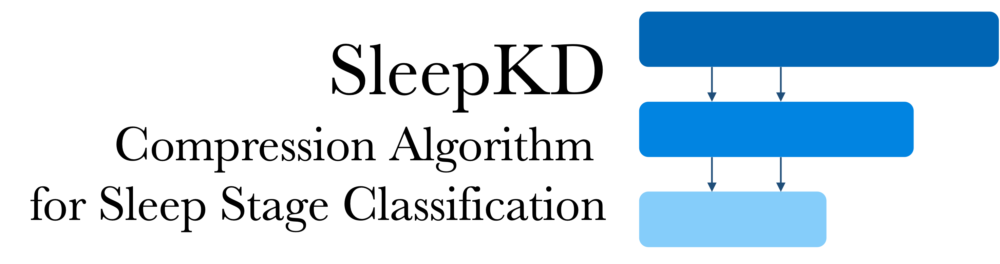
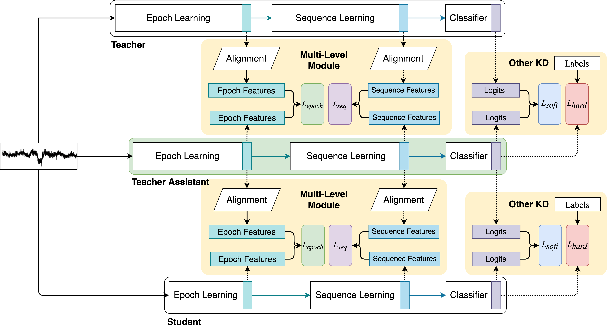

<div align="center">
    
</div>

# SleepKD 
Teacher Assistant-Based Knowledge Distillation Extracting Multi-level Features on Single Channel Sleep EEG

Accepted by IJCAI 2023
[[Paper]](https://www.ijcai.org/proceedings/2023/0439.pdf)
[[Webpage]](https://hychaowang.github.io/SleepKD)



# Reference

```
@inproceedings{DBLP:conf/ijcai/LiangLWJ23,
    author       = {Heng Liang and
                    Yucheng Liu and
                    Haichao Wang and
                    Ziyu Jia},
    title        = {Teacher Assistant-Based Knowledge Distillation Extracting Multi-level
                    Features on Single Channel Sleep {EEG}},
    booktitle    = {Proceedings of the Thirty-Second International Joint Conference on
                    Artificial Intelligence, {IJCAI} 2023, 19th-25th August 2023, Macao,
                    SAR, China},
    pages        = {3948--3956},
    publisher    = {ijcai.org},
    year         = {2023},
    url          = {https://doi.org/10.24963/ijcai.2023/439},
    doi          = {10.24963/ijcai.2023/439},
    timestamp    = {Mon, 14 Aug 2023 16:05:12 +0200},
    biburl       = {https://dblp.org/rec/conf/ijcai/LiangLWJ23.bib},
    bibsource    = {dblp computer science bibliography, https://dblp.org}
    }
```
# Datasets
## ISRUC-III
ISRUC-III collects the PSG data samples from 10 subjects (1 for males and 9 for females) for a whole night in 8 hours. The annotations of this dataset are scored by two professional experts.

## Sleep-EDF
Sleep-EDF is a very famous public dataset that contains the PSG data samples from 20 subjects (10 for males and 10 for females) in 2 days. The ages of the subjects range from 25 to 34 years old. These recordings were manually classi- fied into one of the eight classes (W, N1, N2, N3, N4, REM, Movement, Unknown) by sleep experts according to the R&K standard. For a fair comparison, we remove the Movement and Unknown stage, and merge the N3 and N4 stage into a single N3 stage according to the AASM manual.

# Build With

- TensorFlow 2.5.0
- Python 3.7

# Usage

We provide the distillation file `SleepKD.py`. You need to extract the intermediate features as the inputs of the SleepKD distillation layer.
